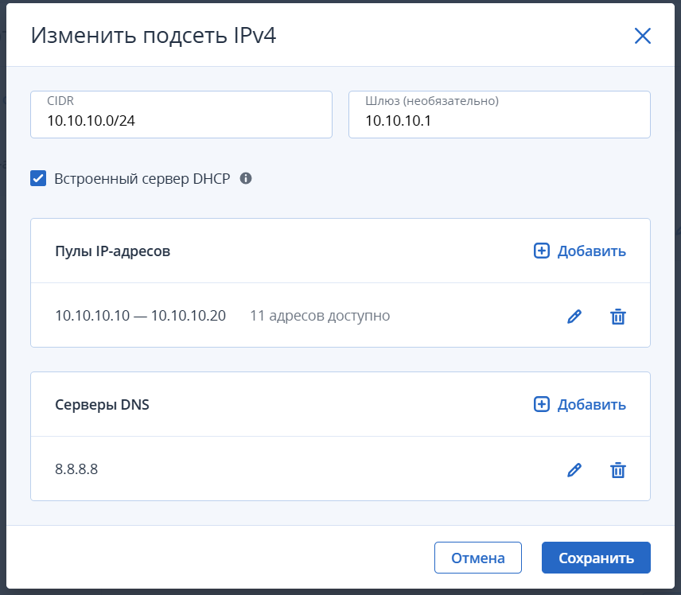
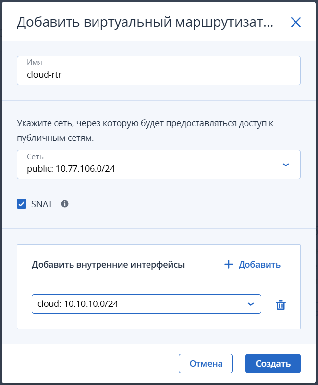
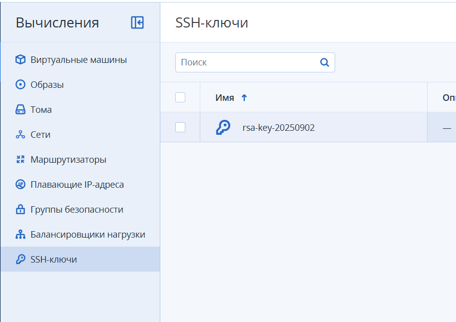
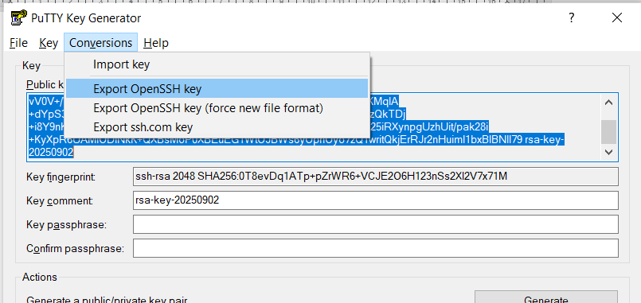
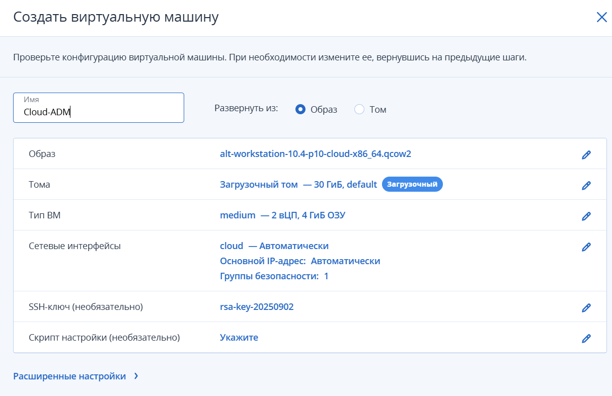
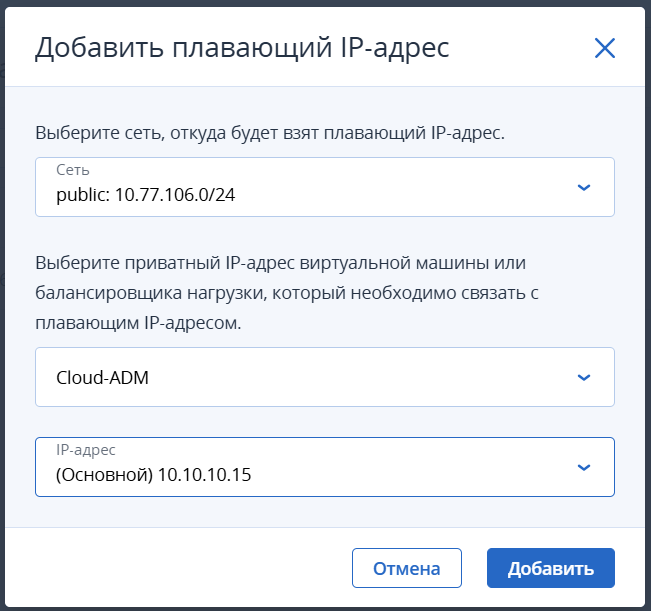
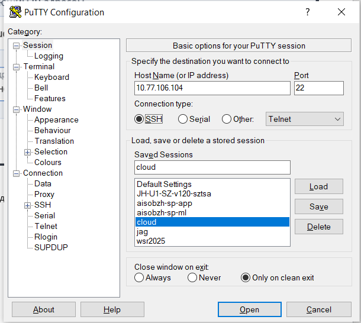

# Создание сети и ВМ
##  1. Создать виртуальную сеть:
Имя произвольное (cloud чтобы не длинное)
Настройки подсети:


## Создаем маршрутизатор:
### Настройки подсети:


### Добавляем ключ SSH сгенерировав его в puttygen


### Приватную часть сохраняем в формате pem на рабочем столе через экспорт



### Создаем ВМ



### Добавить плавающий ip адрес



### Проверить подключение через putty (добавить username в data и ключ в credentials)



Установить xrdp 
```bash
sudo apt-get update && apt-get install xrdp -y
sudo systemctl enable --now xrdp xrdp-sesman
```

Добавить пользователя в группы
```bash
sudo gpasswd -a altlinux tsusers
sudo gpasswd -a altlinux fuse
```

# Terraform
Скачиваем архив с терраформом (уточнить откуда скачивать)
```bash
wget https://hashicorp-releases.yandexcloud.net/terraform/1.13.1/terraform_1.13.1_linux_amd64.zip
```
Разахривируем в папку /usr/local/bin

```bash
sudo unzip terraform_1.13.1_linux_amd64.zip -d /usr/local/bin/
```
Проверяем что все ок

```bash
terraform —version
```
### Устанавливаем openstackcli и пакеты python

```bash
sudo apt-get install python3-module-openstackclient python3-module-pip
pip3 install python-cinderclient
pip3 install python-octaviaclient
pip3 install python-novaclient
```
### Создаем папки проектов

```bash
[altlinux@cloud-adm ~]$ mkdir Projects
[altlinux@cloud-adm ~]$ cd Projects/
[altlinux@cloud-adm Projects]$ mkdir Project01
[altlinux@cloud-adm Projects]$ mkdir Project02
```
Создаем файл cloudinit.conf для аутентификации (содержимое взять из PDF которую скинул в чат, заполнить выделенное зеленым)
```bash
# Terraform
export TF_VAR_OS_AUTH_URL=https://edu.cyber-infrastructure.ru:5000/v3
export TF_VAR_OS_PROJECT_NAME=user15
export TF_VAR_OS_USERNAME=user15
export TF_VAR_OS_PASSWORD=1Ffnhsyc0DgNCW6rlkDs
# openstacl-cli
export OS_AUTH_URL=https://edu.cyber-infrastructure.ru:5000/v3
export OS_IDENTITY_API_VERSION=3
export OS_AUTH_TYPE=password
export OS_PROJECT_DOMAIN_NAME=Competence_SiSA
export OS_USER_DOMAIN_NAME=Competence_SiSA
export OS_PROJECT_NAME=user15
export OS_USERNAME=user15
export OS_PASSWORD=1Ffnhsyc0DgNCW6rlkDs
```

Инициализировать файл – source cloudinit.conf
Проверить что все ок - openstack --insecure server list
Создаем файл конфигурации зеркала Projects (взять с документации ВК)
```bash
nano ~/.terraformrc
provider_installation {
    network_mirror {
        url = "https://terraform-mirror.mcs.mail.ru"
        include = ["registry.terraform.io/*/*"]
    }
    direct {
        exclude = ["registry.terraform.io/*/*"]
    }
}
```
Создаем папку terraform
Создаем файл провайдера – nano provider.tf  (содержимое взять из PDF которую скинул в чат)
```bash
terraform {
required_providers {
openstack = {
source = "terraform-provider-openstack/openstack"
version = "2.1.0"
}
}
}
provider "openstack" {
auth_url = var.OS_AUTH_URL
tenant_name = var.OS_PROJECT_NAME
user_name = var.OS_USERNAME
password = var.OS_PASSWORD
insecure = true
}
```

Проверить что все ок - terraform init
Создаем файл сетей – nano network.tf